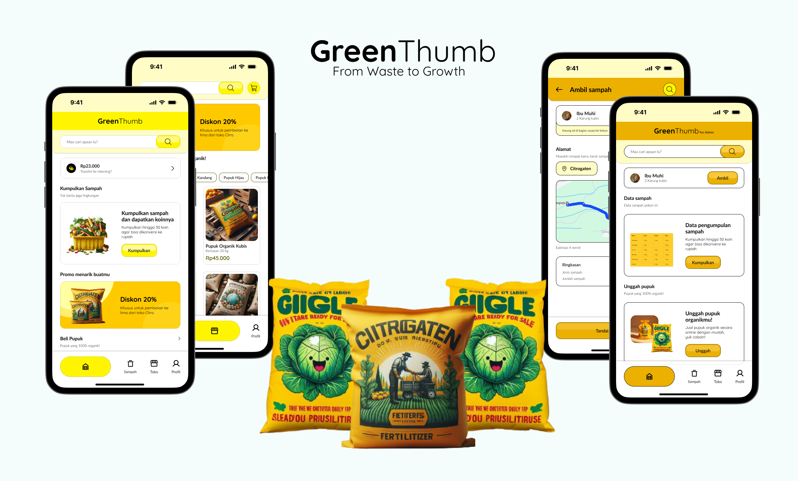

# Green Thumb

Green Thumb mobile application is an innovative step to solve the problem of vegetable waste in Bandungrejo Village. By engaging communities directly, Green Thumb empowers them to turn vegetable waste into high-quality fertilizer, drive sustainable cycles and support local agriculture. Here are the key features that make Green Thumb a leading solution:
1. Efficient Waste Management:
Connecting farmers with nearby waste processing, resource, and Recycle (TPS3R) sites to minimize environmental impact and ensure efficient waste management.
2. Fertilizer Trial Consultation:
Assist farmers in optimizing fertilizer use by providing consultation and information on fertilizer trials that suit the needs of their crops.
3. Fertilizer Distribution:
Facilitate the process of distributing fertilizers produced from well-managed vegetable waste, giving farmers easy access to increase their agricultural output.
4. Fertilizer Market:
Integrating the resulting fertilizer sales platform, allowing farmers to sell their fertilizers at competitive prices and expand market share.
With Green Thumb, we not only manage vegetable waste, but also create sustainable resources that empower local communities and increase agricultural productivity. One small step, big results for sustainability and prosperity.

## Products
Overview Products

Mobile Application

Fertilizer Products

## Team and Role
Created by GIGGLE team for Hackfest 2024
1. Muhamad Azis (Hacker):
   Role: responsible for the technical development of Green Thumb applications.
   Capabilities: expertise in mobile application development, programming, and information security. 
   Purpose: to ensure that the application has optimal performance and performs the required functions.
2. Muhammad Adrian Rizky Wijaya (Hacker):
   Role: involved in backend development and system integration of Green Thumb applications.
   Capabilities: expertise in software development, database management, and system performance optimization.
   Purpose: ensure the application can interact smoothly with the backend system and provide a satisfactory user experience.
3. Ahmad Gunawan Triyanto (Hipster):
   Role: focus on user interface (UI/UX) design of Green Thumb applications.
   Ability: creativity in design, deep understanding of user preferences, and the ability to create compelling visual experiences.
   Purpose: make the application have an attractive appearance and easy to use by users.
4. Salima Fadhilatus Sholihah (Hustler):
   Role: responsible for project management, business development, and marketing strategy of Green Thumb applications.
   Abilities: strong leadership, business analysis, and communication skills.
   Objectives: ensure projects go according to plan, establish partnerships with related parties, and develop effective marketing strategies.
