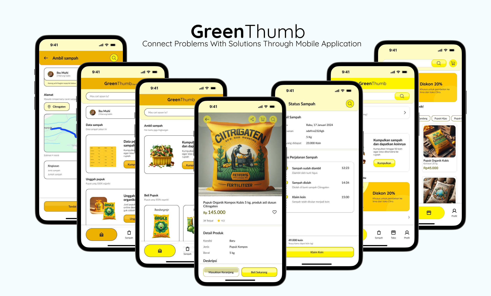
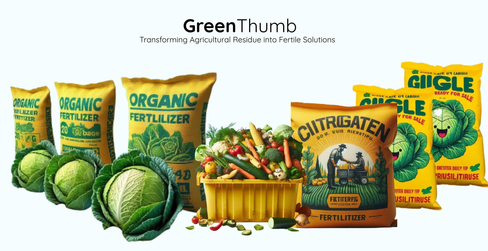

# Green Thumb

Green Thumb mobile application is an innovative step to solve the problem of vegetable waste in Bandungrejo Village. By engaging communities directly, Green Thumb empowers them to turn vegetable waste into high-quality fertilizer, drive sustainable cycles and support local agriculture. Here are the key features that make Green Thumb a leading solution:
1. Efficient Waste Management:
Connecting farmers with nearby waste processing, resource, and Recycle (TPS3R) sites to minimize environmental impact and ensure efficient waste management.
2. Fertilizer Trial Consultation:
Assist farmers in optimizing fertilizer use by providing consultation and information on fertilizer trials that suit the needs of their crops.
3. Fertilizer Distribution:
Facilitate the process of distributing fertilizers produced from well-managed vegetable waste, giving farmers easy access to increase their agricultural output.
4. Fertilizer Market:
Integrating the resulting fertilizer sales platform, allowing farmers to sell their fertilizers at competitive prices and expand market share.

With Green Thumb, we not only manage vegetable waste, but also create sustainable resources that empower local communities and increase agricultural productivity. One small step, big results for sustainability and prosperity.

## Products
Overview Products

Mobile Application

Fertilizer Products

## Application Usage Flow
The following are the actors involved in the use of the Green Thumb mobile application, namely farmers, managers of temporary landfills (TPST3R), communities, and the Center for Plant Variety Protection and agricultural licensing (PVTPP). With the flow of its application pengguaan;

1. Registration and Login:
Farmers, communities, and PVTPP register accounts on the Green Thumb application.
After registration, users login to the app using their account information.
2. Removal of vegetable waste by farmers:
Farmers access the vegetable waste upload feature on the app.
Farmers upload information and photos of vegetable waste that they want to submit.
3. Eligibility Test by Tpst3r manager:
TPST3R managers receive vegetable waste upload notifications from farmers.
Tpst3r managers conduct feasibility tests on vegetable waste for fertilizer production.
The results of the feasibility test are informed to farmers.
4. Marketing license from PVTPP:
PVTPP gives marketing permission to TPST3R for fertilizers that have passed the feasibility test.
5. Points redemption and marketing to farmers:
TPST3R provides fertilizer that has been produced free of charge to farmers.
The points accumulated from each transaction are used to reduce the price or get other benefits.
6. Marketing fertilizer to the community:
TPST3R markets organic fertilizer to the community through a platform on Green Thumb.
Fertilizer prices are determined and visible on the application.
7. Purchase of fertilizer by the community:
People access the fertilizer purchase feature on the Green Thumb application.
People choose the type and amount of fertilizer they want to buy.
People make payments through the methods that have been provided.
8. Confirmation and delivery:
After payment, TPST3R received confirmation of fertilizer purchase from the community.
TPST3R regulates the delivery of fertilizers to the community on order.
9. Finishes and feedback:
Transactions are completed, and the public can provide feedback or rating of products and services through the Green Thumb application.

## Team and Role
Created by GIGGLE team for Hackfest 2024
1. Muhamad Azis (Hacker):
   Role: responsible for the technical development of Green Thumb applications.
   Capabilities: expertise in mobile application development, programming, and information security. 
   Purpose: to ensure that the application has optimal performance and performs the required functions.
2. Muhammad Adrian Rizky Wijaya (Hacker):
   Role: involved in backend development and system integration of Green Thumb applications.
   Capabilities: expertise in software development, database management, and system performance optimization.
   Purpose: ensure the application can interact smoothly with the backend system and provide a satisfactory user experience.
3. Ahmad Gunawan Triyanto (Hipster):
   Role: focus on user interface (UI/UX) design of Green Thumb applications.
   Ability: creativity in design, deep understanding of user preferences, and the ability to create compelling visual experiences.
   Purpose: make the application have an attractive appearance and easy to use by users.
4. Salima Fadhilatus Sholihah (Hustler):
   Role: responsible for project management, business development, and marketing strategy of Green Thumb applications.
   Abilities: strong leadership, business analysis, and communication skills.
   Objectives: ensure projects go according to plan, establish partnerships with related parties, and develop effective marketing strategies.

## How to Use Program Code
General preparation that needs to be done to run is to configure flutter and dart on mac or windows devices.
1. Install Flutter:
Make sure Flutter is installed on your system Download from https://flutter.dev/docs/get-started / install.
2. Install Dart SDK:
The Dart SDK is usually included with Flutter, but if not, you can download it from https://dart.dev / get-dart.
3. Install Visual Studio Code (VS Code):
VS Code is a very popular editor for Flutter development. Download from https://code.visualstudio.com/.
4. Install Flutter and Dart extensions in VS Code:
Open VS Code, go to Extensions (Ctrl+Shift+X) and locate and install the "Flutter" and "Dart" extensions provided by Dart Code and Flutter teams.

Steps taken to run the program
1. Open a Terminal or Command Prompt: 
Open a terminal or command prompt on your system. 
2. Navigate to Flutter project directory:
Use the cd command to move to the directory of your Flutter project.
`cd path/to / your/flutter/project `
3. Run Flutter Application:
Use the following command to run the Flutter application.
`flutter run`
To run on an Android emulator, make sure the emulator is already running.
To run in the iOS simulator, make sure the simulator is already available.
4. Open VS Code:
Open Visual Studio Code.
5. Open Flutter Project:
Open your Flutter project by selecting the project folder via VS Code.
6. Open the file 'main.dart':
Open the main 'main.dart' in the VS Code editor.
7. Press F5 or select "Run and Debug":
Press the F5 key on the keyboard, or Select "Run and Debug" from The Run menu (Ctrl + F5).
8. Select "Dart & Flutter"Configuration:
VS Code will offer configuration options. Select "Dart & Flutter" as the configuration.
9. Wait For The Application To Run:
Wait until VS Code completes the build process and the application runs on the selected emulator or simulator.
10. Debug (Optional):
If you want to debug, add breakpoints to your code, and VS Code will provide debugging controls like "Step Over", "Step Into", etc.